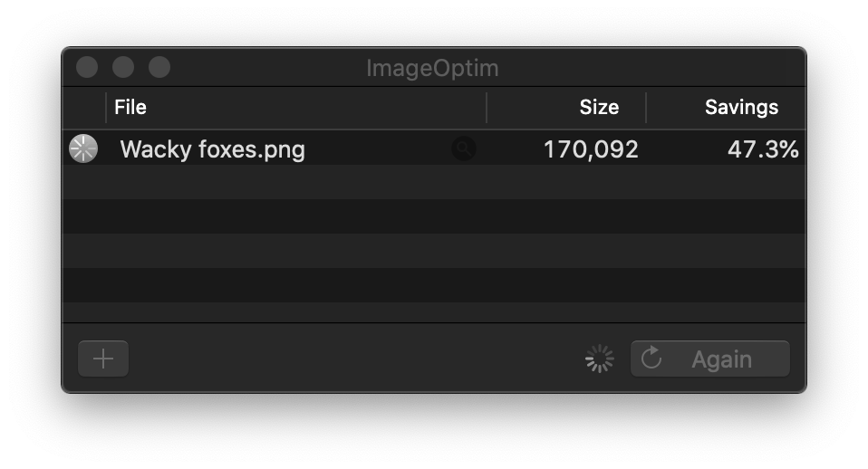

## …don't I already know
# Client Handoffs

---

There’s no hand off in product design.

---

There’s no hand FINAL off in LEAN UX product design.

---

But there could come a time when you must stop working.

---

| Discussion | Intermission | Design | Build | Beta | Announce |
|-|-|-|-|-|-|

---

I'm only talking about the final handoff, not how you conduct in progress deliverables.

---

---

### Mockups

Don't deliver earlier iterations unless they are archived.

---

Clearly name your files.

Remove any form of versioning in the name, naming should describe function.

---

<!-- .slide: class="contained" data-background="./img/bad-naming.png" -->

---

<!-- .slide: class="contained" data-background="./img/good-naming.png" -->

---

### Image Optimization

Web sites are files. These files vary in size. The larger a website, the slower it may load. This impacts page ranking, overall site performance, and the credibility of the site in the eyes of search engines.

---

https://imageoptim.com/mac

---

### Typography

Consider what the client needs to take action on type choices:

* Licenses
* Styles

---

#### Licenses
Don't try to hide the costs, and don't use fonts the client can't afford. Otherwise you could have to hire a very expensive lawyer one day long after finishing with the client.

---

#### Styles
Licensing and getting developers the right fonts is the first step. The next step is proper documentation of your type styles. Apply them throughout your design file to ensure an efficiency and simple design & development process.

https://developer.apple.com/design/human-interface-guidelines/ios/visual-design/typography/
https://material.io/design/typography/the-type-system.html#type-scale

---

<!-- .slide: class="contained" data-background="./img/type-styles.png" -->

---

If you have an H1 on desktop that is 72px, you may not want it to be the same size on mobile. When I make type styles I usually create a desktop and mobile set of type sizes.

Then you need to set rules to clarify how typography works in responsive. Does the type scale up dynamically? Or does it jump to a different size when it reaches a break point. Make sure you clarify how you want the type to behave before you hand off the files.

---

* It ensures your design is consistent: If you take the time before diving in on a project to get your system right, you won’t waste time needing to think about type sizing or spacing. A strong system frees you up to design faster.

* Revisions are much quicker: Imagine you have an app with 120 screens and a stakeholder decides halfway through the design they want to change the font. If type styles are used this is a 5 minute change, if not it will take hours.

---

### UI Documentation

I like to break up sections and treat them simular to the typography. Some of these include:

* Components
* Color
* Grid System
* Responsive Principles
* Micro/Animations 

---

### Version Control

Figma, Google Drive, Github, etc. Pick one and become familiar with it.

---

### Automation

You shouldn't have to redline designs with specs, measurements, and style guides. Use a tool.

[Zeplin](https://zeplin.io/?ref=uxtools.co), [Avocode](https://avocode.com/?ref=uxtools.co), [InVision’s Inspect](http://blog.invisionapp.com/insight-ui-designers-developers-collaboration), [Sympli](https://sympli.io) and [Lingo](https://www.lingoapp.com/) to name a&nbsp;few.

---

The best part of automation is that you can hold the developer and client accountable to your designs. There should be no need for them to generate their own versions.

---

Brand guides don't end at style and assets.

Don't forget to communicate the system you are using to make overarching design decisions. 

---

Help the company continue your thinking into new features.

Here are some examples:

---

You're chosen grid.

[8 Point Grid](https://spec.fm/specifics/8-pt-grid) is an example where divisions of 8 define columns, gutters, font sizes and more.

---

State changes / interactive elements.

[PaintCode](https://medium.com/sketch-app-sources/design-to-development-my-process-for-ios-asset-management-and-handoff-da4fb7d9471e#.nc5kn3sbp) deals with this well.

---

### Checklist

Lets avoid 🤦s when possible.

---

* Maintain a plain-jane checklist of all the cases & features that need to be designed; created & managed by the designer on the project.
* The checklist will flag the status of the feature being picked up or not, and whether it’s completed or under works. All the completed rows should have the link to the corresponding design.
* If a certain feature is moved to the next version because of a certain dependency, then the corresponding team is marked along with a describing comment.

---

### Final Handoff

I like to schedule a handoff meeting so everyone is on the same page.

Usually it is structered like so:
   Provide background on the project
   Walk through the design system and prototype
   Briefly explain the design documentation
   Touch on how success will be measured
   Clarify timeline and set project milestones/goals
   Answer any questions
   Inspire the team (not just the client)

---

### Post Handoff

Often development doesn't match the designs, thats why we plan a clear way to communicate issues.

Some platforms are Asana, Jira, Github.
The key element here is a single place to communicate feature based issues that doesn't distract from implementation but aids it.

---

examples
https://blog.lingoapp.com/building-and-sharing-esalons-visual-language-with-lingo-4b5cd65dcb5f

---

further resources
https://www.intercom.com/blog/there-is-no-hand-off-product-design/

