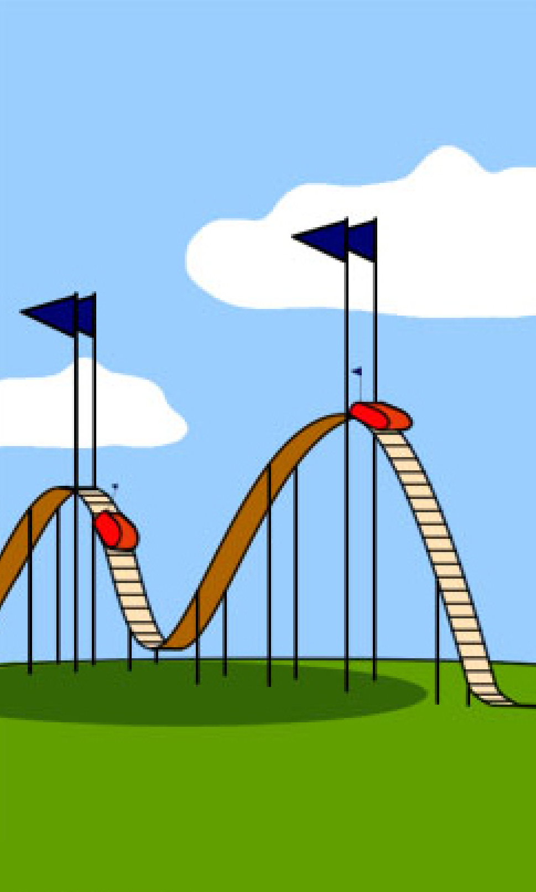
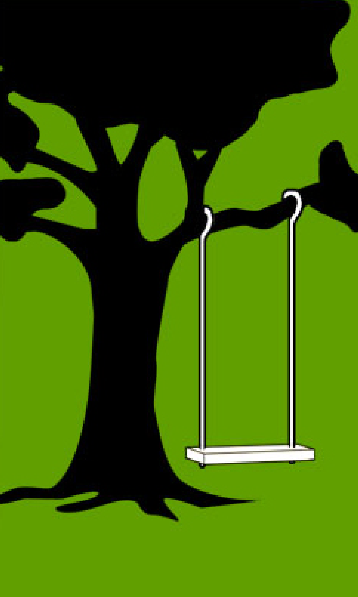
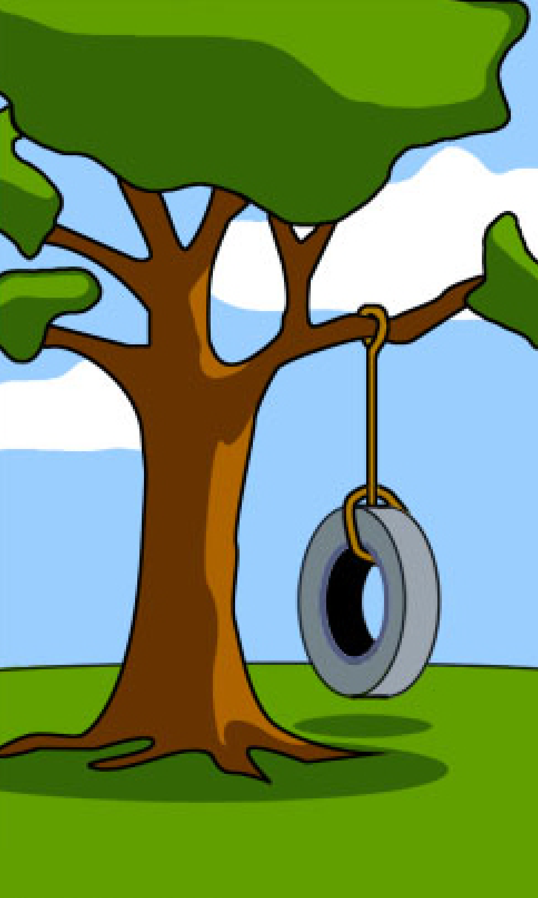

## Lean UX&nbsp;Principles
# Minimum Viable&nbsp;Product (MVP)

---

### Recap
Vision, Framing, and&nbsp;Outcomes
 ↓
 Confidence in a problem/measurable&nbsp;solution

---

|  |  |  |  |  |  |
|-|-|-|-|-|-|
|How the customer explained it|How the project leader understood it|How the analyst designed it|How the programmer wrote it|What the beta testers received|How the business consultant described&nbsp;it|
|  |  |  |  |  |  |

|  |  |  |  |  |  |
|-|-|-|-|-|-|
|How the project was documented|What operations installed|How the customer was billed|How it was supported|What marketing advertised|What the customer really&nbsp;needed|
|  |  |  |  |  |  |

---

### Next
Minimum Viable&nbsp;Product
 ↓
 Quickest path to a measurable&nbsp;solution

---

### MVP
The version of a product which enables the maximum amount of validated (customer) learning with the least&nbsp;effort.

---

A key premise behind this idea is that you produce an actual product (ex. landing page, service with an appearance of automation but which is fully manual behind the scenes) that you can offer to customers and observe their actual behavior with the product or service. Seeing what people actually do with respect to a product is much more reliable than asking people what they would&nbsp;do.

---

<!-- .slide: data-background="./img/mvp.png" -->

---

### Common Pitfalls

* Thinking MVP is the smallest amount of functionality (forgetting that the goal is business viability of the&nbsp;product)
* Not Minimum Marketable Feature (MMF) or Minimum Marketable Product (MMP) (which has a focus on&nbsp;earnings)
* Not preparing a roadmap for further changes to that&nbsp;product.

---

### What an MVP allows
* Customer Interviews
* Landing Pages
* Pre-order Pages
* A/B Tests
* Ad Campaigns
* Fundraising
* Explainer Videos
* Manual Back office (aka “Wizard of&nbsp;Oz”)
* Concierge MVPs (manually guide your&nbsp;user)
* Prototypes

---

### MVP Takeaways
* Just enough to gather validated&nbsp;learning
* Reduces costs/risk if wrong hypothesis (eg. incorrect&nbsp;assumptions)
* A strategy for learning about your&nbsp;customers
* Doesn’t have to go to&nbsp;market
* Not necessarily the smallest product&nbsp;imaginable
* The fastest route through the Build-Measure-Learn feedback&nbsp;loop

---

### Airbnb MVP
With no money to build a business, the founders of Airbnb used their own apartment to validate their idea to create a market offering short-term, peer-to-peer rental housing online. They created a minimalist website, published photos and other details about their property, and found several paying guests almost&nbsp;immediately.

---

### Dropbox MVP
Started with a 3-minute video for their MVP, resulting in signups increasing from 5,000 people to 75,000 overnight—all of this in absence of a real&nbsp;product.

---

### Foursquare MVP
The location-based social network Foursquare started as just a one-feature MVP, offering only check-ins and gamification rewards. It wasn’t until they had validated the idea with an eager and growing user base that the Foursquare development team began adding recommendations, city guides, and other&nbsp;features.

---

### Groupon MVP
A WordPress blog with a widget that sent PDF coupons via&nbsp;email.